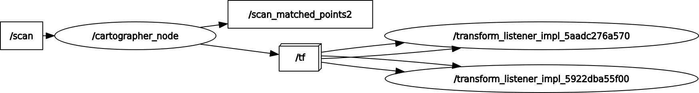

# lucia_cartographer
### Node and Topic

## Dependency
```shell
$ sudo apt install ros-humble-cartographer
$ sudo apt install ros-humble-cartographer-ros
```
## Setup
```shell
$ cd ~/ros2_ws/src  #Go to ros workspace
$ git clone https://github.com/iHaruruki/lucia_cartographer.git #clone this package
$ cd ~/ros2_ws
$ colcon build --symlink-install
$ source install/setup.bash
```
## Usage
### Launch Lucia's motor and LiDAR
```shell
ros2 launch lucia_controller bringup.launch.py
```
### Run Cartographer Node
```shell
ros2 launch lucia_cartographer cartgrapher.launch.py
```
### Run Teleportation Node
```shell
ros2 run teleop_twist_keyboard teleop_twist_keyboard
```
**When you move Lucia, the map will update.**

### Save map
```shell
# Once the entire map is complete, save it
$ ros2 run nav2_map_server map_saver_cli -f ~/map
```
## License
## Authors
## References
