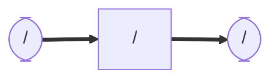

# lucia_cartographer
### Node and Topic

## Dependency
```shell
$ sudo apt install ros-humble-cartographer
$ sudo apt install ros-humble-cartographer-ros
```
## Setup
```shell
$ cd ~/ros2_ws/src  #Go to ros workspace
$ git clone https://github.com/iHaruruki/lucia_cartographer.git #clone this package
$ cd ~/ros2_ws
$ colcon build --symlink-install
$ source install/setup.bash
```
## Usage
```bash
$ ros2 run lucia_controller lucia_controller_node
$ ros2 launch urg_node2 urg_node2.launch.py
$ ros2 launch lucia_description robot.launch.py
$ ros2 launch lucia_cartographer cartgrapher.launch.py
```
## License
## Authors
## References
