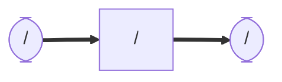

# lucia_cartographer
### Node and Topic

## Dependency
    sudo apt install sudo apt install ros-humble-cartographer

    sudo apt install ros-humble-cartographer-ros

## Setup
    cd ~/ros2_ws/src  #Go to ros workspace

    git clone https://github.com/iHaruruki/lucia_cartographer.git #clone this package

    cd ~/ros2_ws

    colcon build --symlink-install

    source install/setup.bash

## Usage
    ros2 launch lucia_cartographer cartgrapher.launch.py

## License
## Authors
## References
